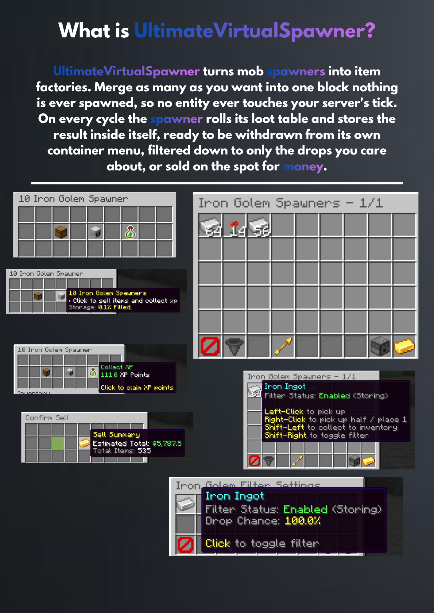
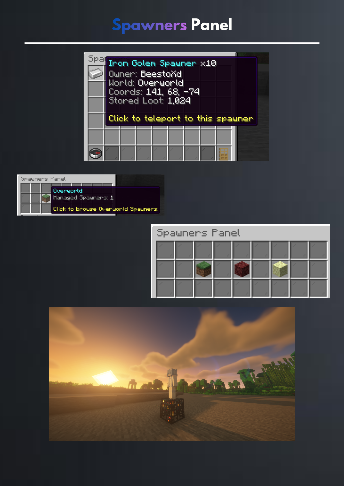

<p align="center">
  
</p>

<h1 align="center">UltimateVirtualSpawner</h1>

<p align="center">
Virtual mob spawners for Minecraft servers. A managed spawner never spawns a real mob — every
cycle it rolls its drop table and deposits the result straight into its own virtual storage, so a
100,000-stack spawner farm costs the server nothing in entities.
</p>

## Supported servers

| Software                  | Minecraft range |
|---------------------------|-----------------|
| Paper / Spigot / Bukkit   | `1.21.10` – `26.2` |
| Folia                     | `1.21.11` – `26.2` |

Escape hatches live in `config.yml` under `COMPATIBILITY`:

- `STRICT: false` — a version string that cannot be parsed is allowed through with a warning
  instead of blocking start-up.
- `ENABLED: false` — skip the gate entirely and start on any server. Unsupported, no guarantees.

## Features

- **Stackable spawners** — up to `MAX_STACK_PER_BLOCK` in a single block, sneak-place and
  sneak-break to move whole stacks, `/spawner split` to break a stack apart.
- **Virtual storage** — a real, clickable container GUI per spawner. Left/right/shift click all
  behave like vanilla, plus shift-right to toggle a material's filter.
- **Drop filters** — per-spawner, per-drop toggles with enable-all / disable-all shortcuts.
- **XP generation** — spawners accumulate XP alongside items, claimed from the main menu.
- **Built-in economy** — balances stored in this plugin's own database, with `/balance`, `/baltop`,
  `/pay` and `/eco`. No economy plugin required; optionally published to Vault so other plugins
  share the same money.
- **Selling** — sell stored loot for money, with a confirmation screen showing the payout, and
  per-permission sell multipliers.
- **Hopper extraction** — optionally pull stored loot into a hopper under the spawner.
- **Anti-ESP** — spawners outside a player's reveal radius (or behind blocks) are sent as
  camouflage blocks, so X-ray clients cannot map other players' farms.
- **Admin panel** — browse every managed spawner per world and teleport to it.
- **Folia-native** — all world access goes through the region scheduler; no main-thread assumptions.

## Screenshots

<p align="center">
  
  
  
  
  
  
  </p>

## Commands

All under `/spawner` (aliases `/spawners`, `/uvs`, `/virtualspawner`).

| Command | Description |
|---|---|
| `/spawner` | Open the admin panel |
| `/spawner info` | Inspect the spawner you are looking at |
| `/spawner panel` | Open the admin panel |
| `/spawner give <player> <type> [amount]` | Give a spawner item |
| `/spawner split <amount>` | Split the held spawner item |
| `/spawner types` | List the configured spawner types |
| `/spawner remove` | Remove the spawner you are looking at |
| `/spawner reload` | Reload every config file |
| `/spawner version` | Show version and compatibility info |

### Economy

Active while `ECONOMY.PROVIDER` is `INTERNAL` (or `AUTO` with no external economy). With an
external economy in charge, these defer to the plugin that owns money.

| Command | Description |
|---|---|
| `/balance [player]` (`/bal`, `/money`) | Show a balance |
| `/baltop [size]` (`/balancetop`) | Richest players |
| `/pay <player> <amount>` | Send money to another player |
| `/eco give\|take\|set <player> <amount>` | Adjust a balance |
| `/eco reset <player>` | Reset to the starting balance |

Amounts accept `K`/`M`/`B`/`T` suffixes: `/eco give Steve 1.5M`.

## Permissions

| Node | Default | Description |
|---|---|---|
| `ultimatevirtualspawner.command.spawner` | everyone | Use `/spawner` |
| `ultimatevirtualspawner.admin.spawner` | op | Full access to every managed spawner |
| `ultimatevirtualspawner.admin.spawner.seeall` | op | Bypass anti-ESP concealment |
| `ultimatevirtualspawner.spawner.bypass` | op | Break spawners without Silk Touch |
| `ultimatevirtualspawner.sell.multiplier.*` | — | Sell multipliers, configured in `spawners.yml` |
| `ultimatevirtualspawner.command.balance` | everyone | Check your own balance |
| `ultimatevirtualspawner.command.balance.others` | op | Check someone else's balance |
| `ultimatevirtualspawner.command.baltop` | everyone | View the richest players |
| `ultimatevirtualspawner.command.pay` | everyone | Send money |
| `ultimatevirtualspawner.command.eco` | op | Give / take / set / reset balances |

## Configuration

| File | Contents |
|---|---|
| `config.yml` | Compatibility gate, database, currency formatting |
| `spawners.yml` | Spawner behaviour, anti-ESP, sell prices, drop tables per type |
| `menus.yml` | Every GUI layout: sizes, slots, materials, titles, lore |
| `messages.yml` | Every chat message |
| `sounds.yml` | Sound effect for each spawner action |

Missing keys are back-filled from the packaged defaults on every load, so updating the plugin
never wipes customised values.

## Economy

Money is handled by the plugin itself. `ECONOMY.PROVIDER` in `config.yml` picks the backend:

| Mode | Behaviour |
|---|---|
| `INTERNAL` (default) | Balances live in this plugin's database. Nothing else to install. |
| `VAULT` | Defer to an external economy plugin (EssentialsX, CMI, ...) through Vault. |
| `AUTO` | Use Vault when an economy provider is registered, otherwise fall back to internal. |

Changing the mode needs a full server restart, not `/spawner reload`.

With `REGISTER_WITH_VAULT: true` (the default) and Vault installed, the built-in economy is
published as a Vault provider — so shops, jobs and similar plugins read and write these same
balances instead of the server ending up with two disconnected pots of money. Vault is *not*
required; without it the economy simply stays internal to this plugin.

Balances are rounded to `DECIMAL_PLACES` on every change so repeated arithmetic cannot drift into
fractions of a cent, and each player's balance is mutated under its own lock so two concurrent
sells cannot interleave into a lost update.

## Dependencies

Both optional:

- **Vault** — only needed to share the economy with other plugins, or to use an external economy
  via `PROVIDER: VAULT`. Selling works without it.
- **PlaceholderAPI** — registers the `uvs` expansion.

JDBC drivers (SQLite, MySQL) are declared as `libraries` in `plugin.yml` and downloaded by the
server on first start, so the plugin jar stays small.

## Placeholders

Requires PlaceholderAPI.

| Placeholder | Value |
|---|---|
| `%uvs_total%` | Managed spawners server-wide |
| `%uvs_types%` | Configured spawner types |
| `%uvs_balance%` | The player's balance, raw number |
| `%uvs_balance_formatted%` | Balance with the currency symbol |
| `%uvs_balance_short%` | Balance, compact (`$1.5K`) |
| `%uvs_owned%` | Spawners owned by the player |
| `%uvs_owned_stack%` | Total stack size across their spawners |
| `%uvs_owned_stored%` | Total stored loot across their spawners |
| `%uvs_owned_xp%` | Total stored XP across their spawners |
| `%uvs_world%` | Managed spawners in the player's world |
| `%uvs_looking_type%` etc. | `type`, `owner`, `stack`, `stored`, `xp`, `access` of the spawner in front of them |

## Building

Requires JDK 21+ and Maven.

```bash
mvn clean package
```

The artifact lands in `target/UltimateVirtualSpawner-<version>.jar`.